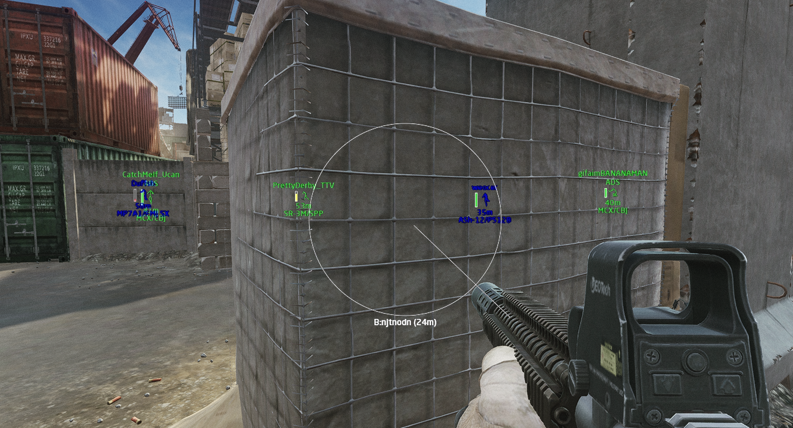
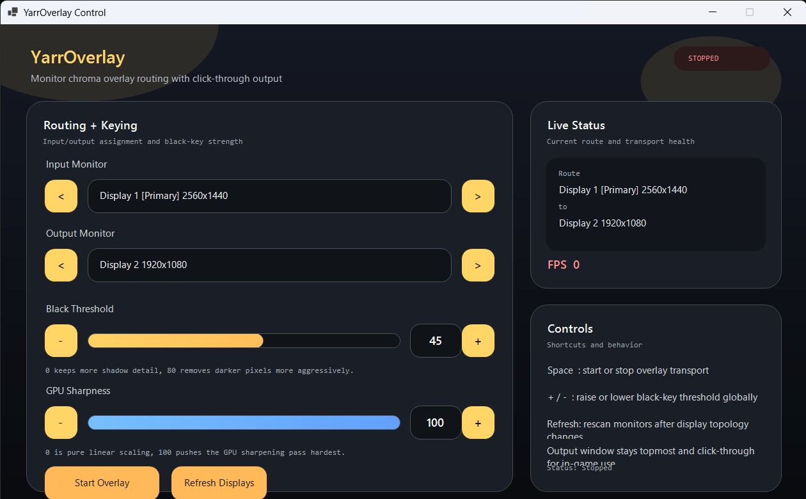

# YarrOverlay

YarrOverlay is a vibe-coded Windows overlay tool built as a DMA Fuser alternative, tuned for low latency and high image quality.

It captures the selected input display, removes near-black pixels, scales the result to the selected output display, and presents it as a click-through topmost overlay. The control window is separate from the overlay window so the game can continue receiving input on the output monitor.

For normal use, you need a second physical monitor or a virtual display. One display is used as the input source, and another display is used as the click-through overlay output.

## Preview

## What it does

- Detects all connected monitors and lets you choose input and output displays
- Removes black or near-black pixels with an adjustable threshold
- Scales the input image to the output resolution
- Applies GPU-based sharpening during upscale
- Keeps the overlay topmost and click-through

## Requirements

- Windows 10 or later
- .NET 10 SDK
- A GPU and display driver that support DXGI Desktop Duplication
- A secondary monitor or a virtual display for the input source

## Controls

- `Space`: start or stop the overlay
- `+` / `-`: raise or lower the black threshold
- Use the control window buttons to switch monitors, refresh displays, and adjust GPU sharpness

## Notes

- The overlay window is intentionally click-through so input passes to the application underneath.
- The app is designed around a two-display setup. If you only have one physical screen, use a virtual display driver for the input side.
- If the output monitor changes or display topology is updated, use `Refresh Displays`.
- Very high sharpness values can make edges look harsher depending on the source image.
