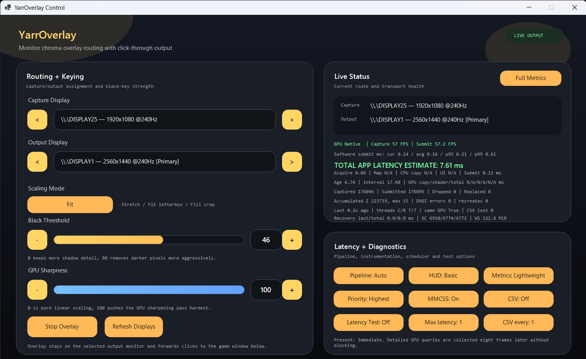
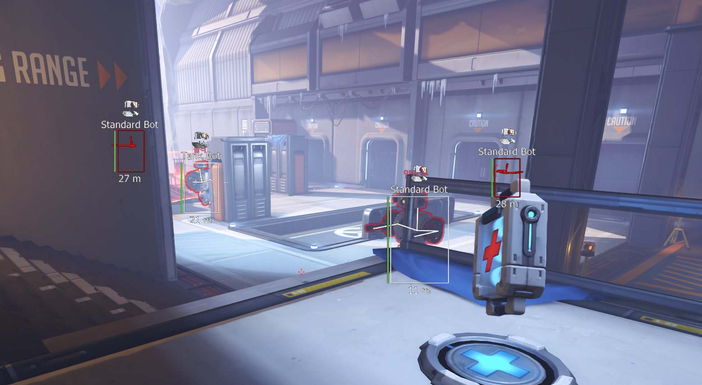
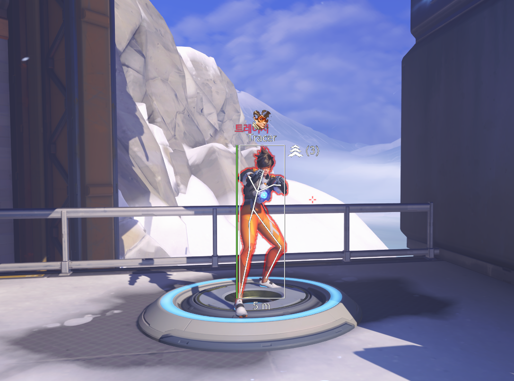
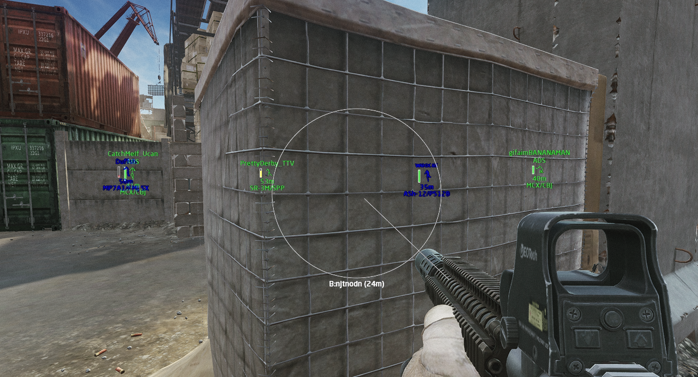
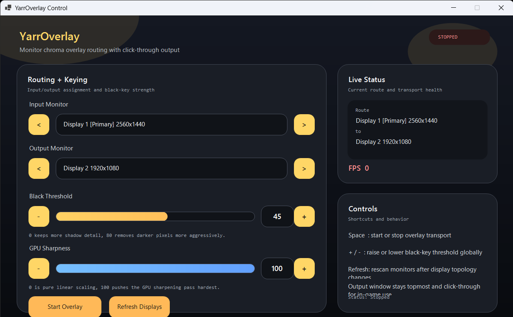

# YarrOverlay

> **A vibe-coded DMA Fuser alternative focused on low-latency, high-quality overlays for Windows.**

YarrOverlay replaces the display-fusing role of a hardware DMA Fuser in a software-only setup. It captures a live monitor source, removes black and near-black background pixels, and places the remaining image on another monitor as a transparent, topmost, click-through overlay.

It uses DXGI Desktop Duplication for capture, a D3D11 shader for black removal, scaling and sharpening, and DirectComposition for GPU-native output.

## Highlights

- GPU-native capture-to-overlay path
- Adjustable black threshold, scaling and sharpening
- Transparent, topmost and click-through output
- Virtual-display and physical-display routing
- Basic latency HUD and detailed performance metrics
- Automatic DXGI recovery
- Legacy CPU fallback for unsupported or cross-adapter routes

## Benchmark

Measured on a GeForce RTX 4070 SUPER using a `1920x1080 @ 120 Hz` virtual display and a `2560x1440 @ 240 Hz` physical output:

| Pipeline | Average | P95 | P99 |
|---|---:|---:|---:|
| Legacy CPU | 19.97 ms | 25.80 ms | 32.24 ms |
| GPU Native | **0.28 ms** | **0.57 ms** | **0.71 ms** |

The GPU Native path removed full-frame GPU readback, Bitmap creation and GDI submission. These values measure YarrOverlay's internal software-submit latency, not complete Parsec network or physical display latency. See [PERFORMANCE.md](./PERFORMANCE.md) for the full report.

## Recommended Setup

### Hardware

- Windows 10 or Windows 11
- A modern NVIDIA, AMD or Intel GPU with DXGI Desktop Duplication support
- Capture and output displays connected to the same GPU adapter
- 16 GB RAM or more
- A 120 Hz or faster virtual source display
- A 144 Hz or faster physical output display
- Matching aspect ratios, preferably 16:9

### YarrOverlay settings

| Setting | Recommended value |
|---|---|
| Pipeline | `Auto` — confirm that Live Status shows `GPU Native` |
| Scaling | `Stretch` for matching 16:9 resolutions |
| Black Threshold | `40–45` as a starting point |
| GPU Sharpness | `30–50`, adjusted for preference |
| HUD | `Basic` |
| Metrics | `Lightweight` |
| Maximum Frame Latency | `1` |
| Present Mode | `Immediate` |
| Capture Priority | `AboveNormal` |
| MMCSS | `On` |
| CSV | `Off` during normal use |
| Latency Test | `Off` during normal use |

## Setup Guide

### 1. Install a virtual display

Install [timminator's Virtual Display Driver](https://github.com/timminator/Virtual-Display-Driver) using its setup wizard. Prebuilt installers are available on the project's [Releases page](https://github.com/timminator/Virtual-Display-Driver/releases).

After installation:

1. Open **Windows Settings → System → Display**.
2. Select **Extend these displays**. Do not switch the system to the virtual display only.
3. Keep the physical monitor as the primary display.
4. Set the virtual display to `1920x1080` and your preferred refresh rate, such as `120 Hz` or `240 Hz`.
5. In **Advanced display**, confirm that both monitors are active.

### 2. Prepare Parsec

1. Start Parsec Client on the PC running YarrOverlay.
2. Connect to the remote host.
3. Move the Parsec window onto the virtual display. `Win + Shift + Left/Right Arrow` is useful when the virtual screen is not directly visible.
4. Enter full screen on the virtual display.
5. Match the Parsec stream resolution and frame rate to the virtual display where possible.

### 3. Configure YarrOverlay

1. Download the latest YarrOverlay release and extract the ZIP.
2. Install the [.NET 10 Desktop Runtime](https://dotnet.microsoft.com/en-us/download/dotnet/10.0) if Windows asks for it.
3. Run `YarrOverlay.exe`.
4. Set **Capture Display** to the virtual display containing Parsec.
5. Set **Output Display** to the physical monitor.
6. Select `Auto`, `Maximum Frame Latency: 1`, `Immediate`, `AboveNormal`, and `MMCSS: On`.
7. Choose `Stretch` when both displays use the same aspect ratio.
8. Adjust the black threshold until the black background disappears without removing wanted dark details.
9. Press **Start Overlay**.
10. Confirm that Live Status reports `GPU Native`. `Legacy CPU` works as a fallback but adds significantly more latency.

The Basic HUD shows the latest application-side latency estimate in a compact format:

```text
YarrOverlay | 7.61 ms
```

This estimate ends when the overlay frame is submitted. It does not include physical monitor scan-out or photon response time.

## Quick Troubleshooting

- **The virtual display is blank or invisible:** verify that Windows is using **Extend these displays**, then move Parsec with `Win + Shift + Left/Right Arrow`.
- **Nothing appears in the overlay:** make sure Parsec is full-screen on the selected Capture Display and that Capture and Output are different displays.
- **Live Status shows Legacy CPU:** both displays may be on different GPU adapters, or GPU Native initialization failed. Check `YarrOverlay.log` beside the executable.
- **The image is cropped:** use `Stretch` for matching aspect ratios or `Fit` to preserve the full source image.
- **Dark details disappear:** reduce Black Threshold.
- **Edges look oversharpened:** reduce GPU Sharpness. Sharpness strength has almost no latency impact because the same shader path is used.

## Build from Source

```powershell
dotnet build Overlay.slnx -c Release
dotnet run --project Overlay -c Release
```

Use `--autostart` to start the saved route automatically:

```powershell
dotnet run --project Overlay -c Release -- --autostart
```

## Screenshots

### Control Panel and Live Metrics



### Overlay Output Examples





### Additional Screenshots




