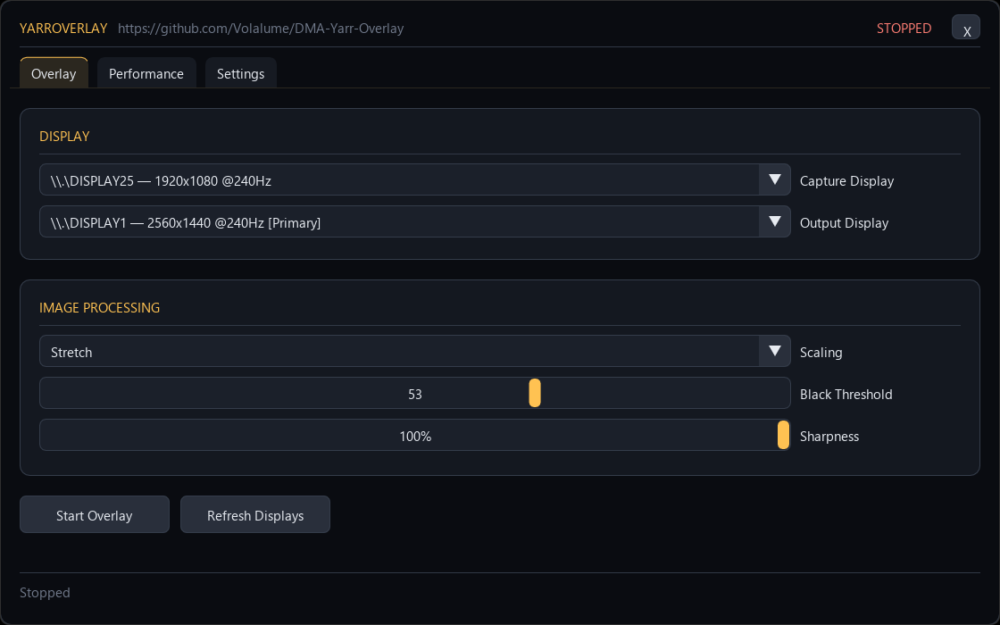
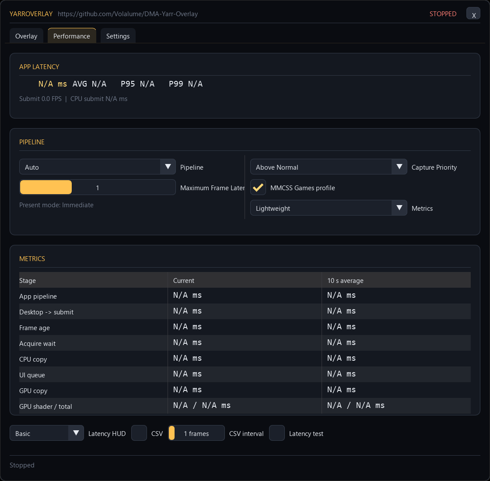
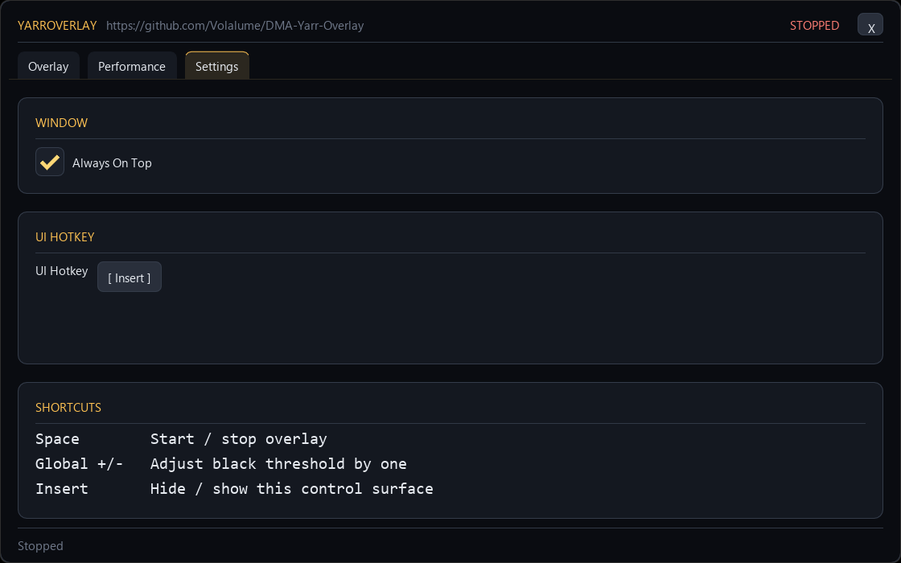

# YarrOverlay

> **A vibe-coded DMA Fuser alternative focused on low-latency, high-quality overlays for Windows.**

YarrOverlay replaces the display-compositing role of a hardware DMA Fuser with a Windows application. It captures a live monitor source, removes black and near-black pixels, and presents the remaining image as a transparent, topmost, click-through overlay on another monitor.

The normal path stays on the GPU: DXGI Desktop Duplication captures the source, a D3D11 shader performs chroma removal, scaling, and sharpening, and DirectComposition presents the result. When **Hardware Level** protection is selected, the source switches to Windows Graphics Capture so Parsec's virtual-display transitions do not invalidate Desktop Duplication; the protected DirectComposition output remains unchanged. A virtual display running a full-screen Parsec session is the intended source, but any separate active Windows display can be used.

## Highlights

- GPU-native capture and DirectComposition output with no full-frame CPU readback
- Adjustable black threshold, scaling mode, and GPU sharpening
- Independent capture and output display routing
- Transparent, topmost, click-through full-screen output
- Compact latency HUD, detailed metrics, and optional CSV diagnostics
- Unified Anti-Capture levels with live Windows affinity and GPU protection verification
- Legacy CPU fallback for unsupported or cross-adapter routes

## Setup Guide

### 1. Install a virtual display

Install [timminator's Virtual Display Driver](https://github.com/timminator/Virtual-Display-Driver) from its [Releases page](https://github.com/timminator/Virtual-Display-Driver/releases), then restart Windows if requested.

Open **Windows Settings → System → Display** and configure the displays as follows:

1. Select **Extend these displays**.
2. Keep the physical monitor as the primary display.
3. Set the virtual display to the desired resolution and refresh rate.
4. Confirm that both displays remain active under **Advanced display**.

### 2. Prepare Parsec

1. Connect to the remote PC with Parsec.
2. Move the Parsec window onto the virtual display. `Win + Shift + Left/Right Arrow` is useful when the virtual display is not directly visible.
3. Make Parsec full-screen on the virtual display.
4. Match the Parsec stream resolution and refresh rate to the virtual display where possible.

### 3. Configure YarrOverlay

1. Download and extract the latest release.
2. Run `YarrOverlay.exe`.
3. Under **Overlay**, select the virtual/Parsec display as **Capture Display**.
4. Select the physical monitor as **Output Display**.
5. Choose the scaling mode and adjust **Black Threshold** until the background disappears without removing wanted dark details.
6. Adjust **Sharpness** to preference.
7. Press **Start Overlay**.
8. Under **Performance**, confirm that the active pipeline is `GPU Native` for the lowest application-side latency.

The Basic HUD displays the current application-side estimate in this format:

```text
YarrOverlay | 7.61 ms
```

This estimate ends when YarrOverlay submits the frame. It does not include Parsec network latency, physical display scan-out, or pixel response time.

## Recommended Setup / Troubleshooting

### Recommended settings

For the best results, connect the capture and output displays to the same GPU. A 120 Hz or faster virtual source and a 144 Hz or faster physical output are recommended; matching aspect ratios simplify scaling.

| Setting | Recommended value |
|---|---|
| Pipeline | `Auto` — verify that it resolves to `GPU Native` |
| Scaling | `Stretch` for matching aspect ratios; otherwise `Fit` |
| Black Threshold | Start around `40–45` |
| Sharpness | Start around `30–50` |
| Maximum Frame Latency | `1` |
| Capture Priority | `Above Normal` |
| MMCSS Games profile | `On` |
| Latency HUD | `Basic` |
| Metrics | `Lightweight` |
| CSV / Latency Test | `Off` during normal use |

### Anti-Capture

Open **Settings → Anti-Capture** and select one level:

- **Off:** normal capture behavior.
- **Software Level:** uses Windows display affinity for both the output overlay and latency HUD. `Black` returns a black protected region in supported capture paths; `Exclude` omits the protected windows so the desktop underneath can remain visible.
- **Hardware Level:** experimental. Requires `Auto` or `GPU Native`, both displays on the same GPU, and compatible WDDM/GPU drivers. It combines verified `Black` window affinity with a `HW_PROTECTED | DISPLAY_ONLY` GPU swap chain. Its source uses Windows Graphics Capture instead of Desktop Duplication to avoid Parsec/VDD invalidation. It never falls back to an unprotected or CPU path while selected.
- **Kernel Level:** reserved in the UI and not implemented.

Changing a level or switching between `Black` and `Exclude` rebuilds the output window and renderer immediately; restarting YarrOverlay is not required. The colored label reads the current Windows value with `GetWindowDisplayAffinity` instead of repeating the selected option:

- **Green:** the requested mode matches the actual overlay/HUD affinity. Hardware mode is also presenting protected frames.
- **Amber:** Hardware mode is checking, waiting, or reconnecting.
- **Red:** the requested and actual modes differ, verification failed, or protected output was blocked.

The label includes the values Windows currently reports: `OFF (0x0)`, `BLACK (0x1)`, or `EXCLUDE (0x11)`. Hover it for verification details. Hardware mode preserves its protected output surface while Desktop Duplication reconnects after Game Bar or display transitions.

Anti-Capture is a best-effort Windows content-protection feature, not DRM or a guarantee against kernel malware, external capture hardware, or cameras. Capture behavior still depends on the API used by the target recording application. Hardware Level protects the output path only; the source display, control panel, and data before protected rendering remain outside that path.

### Quick troubleshooting

- **The virtual display is blank or missing:** use **Extend these displays**, verify it under **Advanced display**, and move Parsec with `Win + Shift + Left/Right Arrow`.
- **Nothing appears after Start:** ensure Capture and Output are different active displays and Parsec is visible on the selected source.
- **The pipeline shows Legacy CPU:** place both displays on the same GPU or inspect the log for the GPU Native initialization error.
- **Hardware Level shows Blocked:** select `Auto` or `GPU Native`, verify the same-adapter route, then press **Retry**. No unprotected fallback is attempted.
- **Game Bar or Parsec interrupts the source:** Hardware Level uses Windows Graphics Capture for the source; if the session still closes, press **Stop Overlay**, reconnect Parsec, and press **Start Overlay**. Software Level retains the Desktop Duplication path and reconnects it after normal display transitions.
- **Black/Exclude looks unchanged:** check the colored label first. A green label confirms the Windows affinity value; the capture application may not support that policy or may need its capture session restarted.
- **Dark content disappears:** lower **Black Threshold**.
- **Edges look oversharpened:** lower **Sharpness**. It uses the same shader pass and has negligible latency impact.
- **Metrics do not fit:** scroll while the pointer is over the **Metrics** card. Other tabs keep the Overlay tab's window size.

Logs and saved settings are stored under `%LOCALAPPDATA%\YarrOverlay`.

## Build

Requirements:

- Windows 10 or Windows 11 x64
- [.NET 10 SDK](https://dotnet.microsoft.com/en-us/download/dotnet/10.0)

Build and run from PowerShell:

```powershell
dotnet restore Overlay.slnx
dotnet build Overlay.slnx -c Release
dotnet run --project Overlay -c Release
```

Start the saved route automatically:

```powershell
dotnet run --project Overlay -c Release -- --autostart
```

Create the configured self-contained, single-file Windows build:

```powershell
dotnet publish Overlay/Overlay.csproj -c Release
```

The published executable is written to `Overlay/bin/Release/single-file/`.

## Screenshots

### Control Panel and Live Metrics





### Overlay Output Examples


